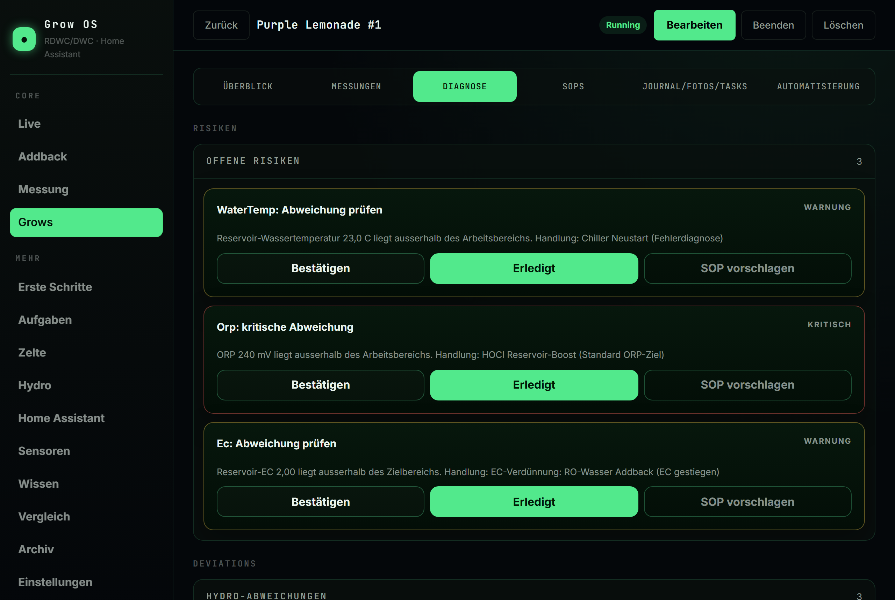
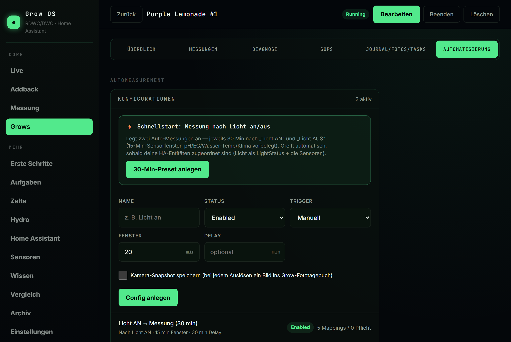
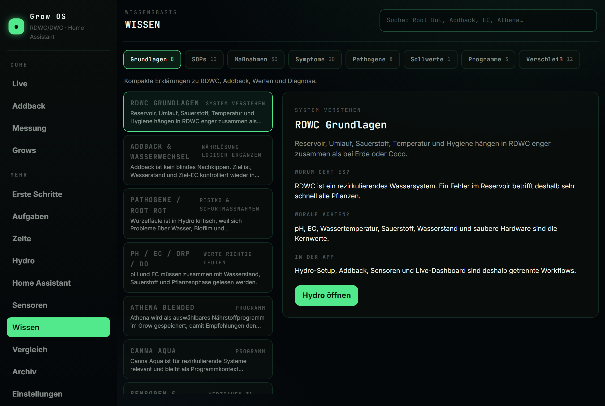
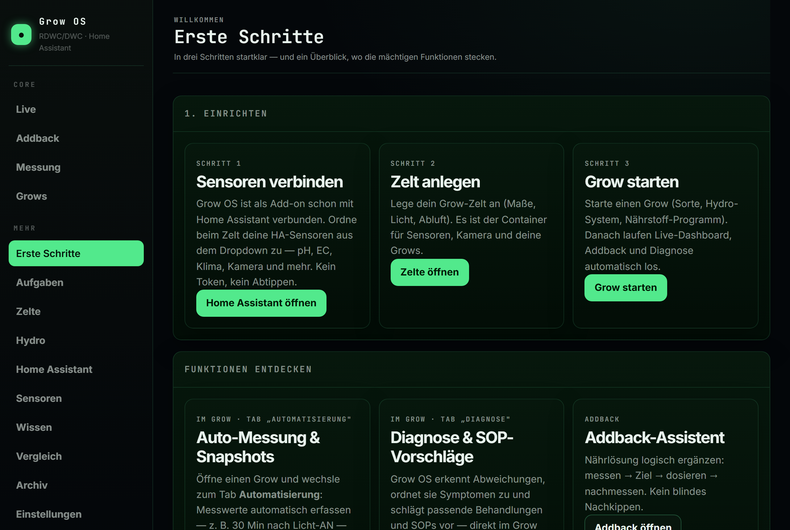

# Grow OS — das RDWC/DWC-Grow-Add-on für Home Assistant

[English](README.md) · **Deutsch**

**Mach aus deinen Home-Assistant-Sensoren ein echtes Grow-Management-Cockpit.** Grow OS
ist ein kostenloses, lokal-first Home-Assistant-Add-on für Hydro-Grower (RDWC/DWC): ein
Live-Instrumenten-Dashboard, Grow-Dokumentation, SOPs, Hardware- & Wartungs-Tracking,
sensorgestützte Diagnose und Risiko-Warnungen — alles direkt in Home Assistant, alles
auf deiner eigenen Hardware. Keine Cloud, kein Account, kein SaaS.

<p align="center">
  
</p>

## Warum Grow OS

- **Home-Assistant-nativ.** Es liest deine vorhandenen HA-Entitäten — dadurch
  funktioniert *jeder* Sensor, den HA unterstützt: pH, EC, Wassertemperatur, DO, ORP,
  CO₂, PPFD, Zeltklima, Kameras. Keine proprietäre Hardware nötig.
- **Für rezirkulierendes Hydro (RDWC/DWC) gebaut.** Reservoir, Addback, Wasserwechsel,
  Phasen-Zielwerte und eine Diagnose-Engine, die Abweichungen auf Symptome und
  empfohlene Behandlungen/SOPs abbildet.
- **Ein-Klick-Installation, keine Konfiguration.** Als Add-on verbindet es sich
  **automatisch** mit Home Assistant — keine URL, kein Token. Sensoren wählst du aus
  einem Dropdown deiner echten Entitäten.
- **Lokal-first.** Deine Daten bleiben auf deinem Gerät und sind in den
  Home-Assistant-Backups enthalten. Nichts verlässt dein Netzwerk.

## Funktionen

- 📊 **Live-Instrumenten-Dashboard** — Klima, VPD, Reservoir, Lichtstatus und ein
  System-Score auf einen Blick, mit fast-Echtzeit-Zeltkamera.
- 💧 **Addback- & Wasserwechsel-Assistent** — messen, Ziel, dosieren, nachmessen; nichts
  blind.
- 🧪 **Auto-Messungen** — Sensorwerte (und Kamera-Snapshots) per Trigger erfassen,
  z. B. *30 Min nach Licht-AN*.
- 🩺 **Diagnose & Risiko-Tracking** — Abweichungen werden zu Symptomen mit
  wahrscheinlichen Ursachen und verknüpften Behandlungen/SOPs; für Strom-/Pumpen-/DO-
  Notfälle gibt es geführte Recovery-SOPs.
- 📚 **Wissensbasis** — durchsuchbare Guides, SOPs, Behandlungen, Symptome, Pathogene,
  Zielwerte und Nährstoff-Programme.
- 🔧 **Hardware & Wartung** — Lebensdauer, Inspektions- und Kalibrier-Erinnerungen pro
  Sensor.
- 📱 **Mobiltauglich** — läuft direkt in der Home-Assistant-App.

<p align="center">
  
</p>

## Screenshots

<table>
  <tr>
    <td width="50%"><br><sub><b>Diagnose</b> — Abweichungen auf Symptome abgebildet, mit Behandlungs-/SOP-Vorschlägen</sub></td>
    <td width="50%"><br><sub><b>Automatisierung</b> — Auto-Messungen & Kamera-Snapshots per Trigger (z. B. 30 Min nach Licht-AN)</sub></td>
  </tr>
  <tr>
    <td width="50%"><br><sub><b>Wissensbasis</b> — durchsuchbare SOPs, Behandlungen, Symptome und Zielwerte</sub></td>
    <td width="50%"><br><sub><b>Erste Schritte</b> — geführtes Onboarding, das jede Funktion zeigt</sub></td>
  </tr>
</table>

## Installation (Home Assistant Add-on)

**Voraussetzung: Home Assistant OS oder Supervised** (bei Home Assistant Container/Core
gibt es keine Add-ons).

1. In Home Assistant: **Einstellungen → Add-ons → Add-on-Store**.
2. Oben rechts **⋮ → Repositories**, und hinzufügen:

   ```
   https://github.com/Nerdstreak/Grow-Operation-System
   ```

3. **Grow OS** erscheint im Store → **Installieren** → **Starten**.
4. Über die Home-Assistant-Seitenleiste öffnen (🌱). Es ist bereits mit Home Assistant
   verbunden — wähl einfach deine Sensoren aus dem Dropdown.

Updates sind ein sauberer Ein-Klick-Pull aus Home Assistant; deine Daten bleiben
erhalten.

## Dokumentation

Die Doku liegt unter [docs/](docs/):

- [Installation](docs/install.md)
- [Architektur](docs/architecture.md)
- [Grow-Domäne](docs/grow-domain-notes.md)
- [Entwicklung](docs/development.md)

## Lizenz

Veröffentlicht unter der [MIT-Lizenz](LICENSE) — frei nutzbar, anpassbar und
weiterverteilbar.
