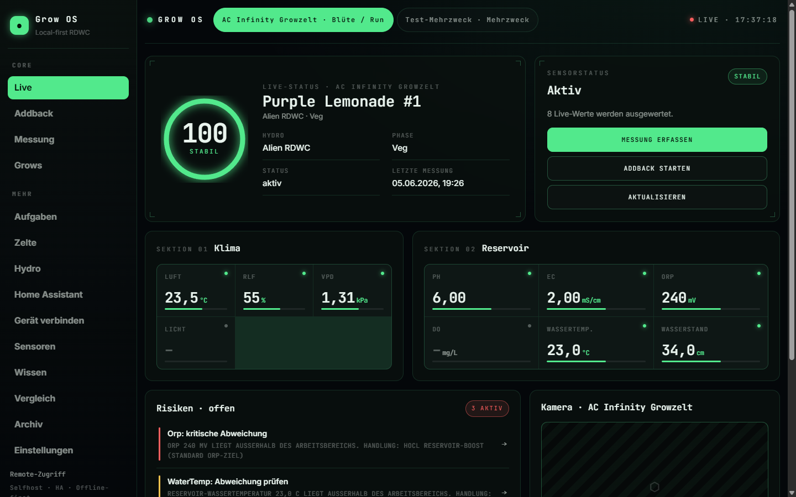
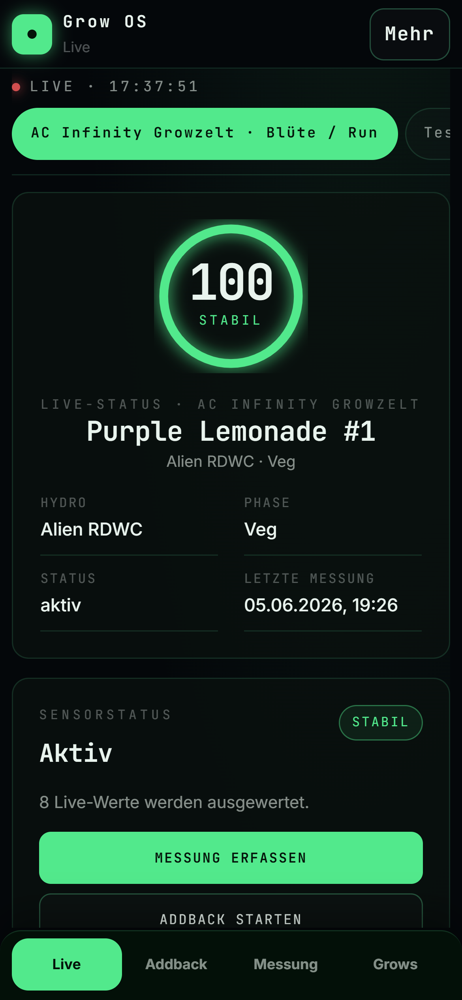

# Grow OS installieren

Grow OS ist ein **Home-Assistant-Add-on**. Die Installation dauert unter einer Minute
und braucht **keine Programmierkenntnisse**.

> Entwickler, die den Quellcode bauen wollen, finden alles unter [setup.md](setup.md).

## So sieht Grow OS aus

<p align="center">
  
</p>
<p align="center">
  
</p>

---

## Voraussetzung

Eine **Home Assistant OS**- oder **Supervised**-Installation. Bei Home Assistant
Container/Core gibt es keine Add-ons.

Grow OS bezieht seine Sensordaten aus Home Assistant — deshalb läuft alles direkt als
Add-on *in* Home Assistant, ohne separaten Server und ohne manuelle Verbindung.

## Schritt 1 — Repository hinzufügen

In Home Assistant: **Einstellungen → Add-ons → Add-on-Store**, oben rechts
**⋮ → Repositories**, und diese Adresse einfügen:

```
https://github.com/Nerdstreak/Grow-Operation-System
```

## Schritt 2 — Installieren und starten

**Grow OS** erscheint im Store → **Installieren** → **Starten**.

## Schritt 3 — Öffnen und Sensoren wählen

Grow OS erscheint in der **Seitenleiste** von Home Assistant (Symbol 🌱). Es ist
**sofort mit Home Assistant verbunden** — keine URL, kein Token. Beim Zelt-Mapping
wählst du deine Sensoren bequem aus einem **Dropdown** deiner echten HA-Entitäten
(kein Abtippen von Entity-IDs).

> Home Assistant verwaltet die Updates und sichert die Grow-OS-Daten in seinen eigenen
> Backups automatisch mit. Updates sind ein sauberer Ein-Klick-Pull — deine Daten
> bleiben erhalten.

---

## Kamera einbinden (optional)

Grow OS zeigt das Live-Bild jeder Kamera-Entity, die in Home Assistant verfügbar ist
(z. B. eine USB-Webcam über [go2rtc](https://github.com/AlexxIT/go2rtc)). Beim
Zelt-Mapping die Kamera-Entity aus dem Dropdown wählen und „Kamera testen".

## Probleme?

- **Add-on erscheint nicht im Store?** ⋮ → „Nach Updates suchen", Seite neu laden;
  notfalls den **Supervisor neu starten** (Einstellungen → System).
- **Kein Bild / Fehler?** Add-on-Tab **Protokoll** ansehen; nach Änderungen
  **Neu starten**. Prüfe, ob deine Entitäten in Home Assistant sichtbar sind.
- Fragen oder Fehler bitte als
  [GitHub Issue](https://github.com/Nerdstreak/Grow-Operation-System/issues) melden.
